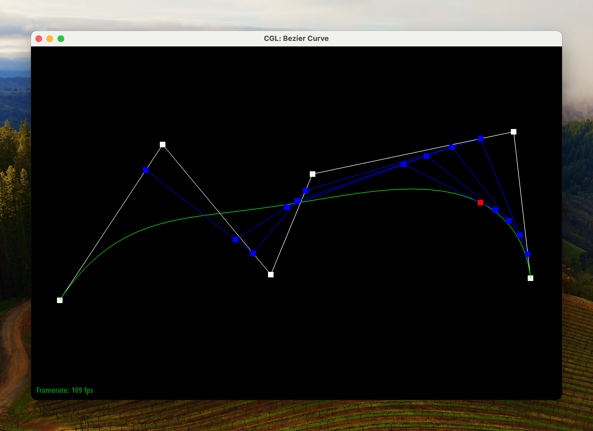

## Part 1

De Casteljau's algorithm is a simple recursive method for evaluating Bezier
curves. Given a Bezier curve with $N$ control points and some desired parameter
$t \in [0, 1]$ on the curve, we can map each "segment" (i.e. pair of consecutive
control points) into a new point by traveling $t$ of the way from the first
control point to the second. This can be easily computed as a weighted average,
and leaves us with a set of $N-1$ points. It turns out that these points form a
new Bezier curve that coincides exactly with the old one, so we can simply
repeat the process until we have only one point left. This point is the value of
the Bezier curve at the parameter $t$.

We picked a Bezier curve of six points. Shown is a progression of the algorithm:

- 
- 
- 
- 
- 
- 
- 

Here's a slightly different curve evaluated at a different parameter:

- 
